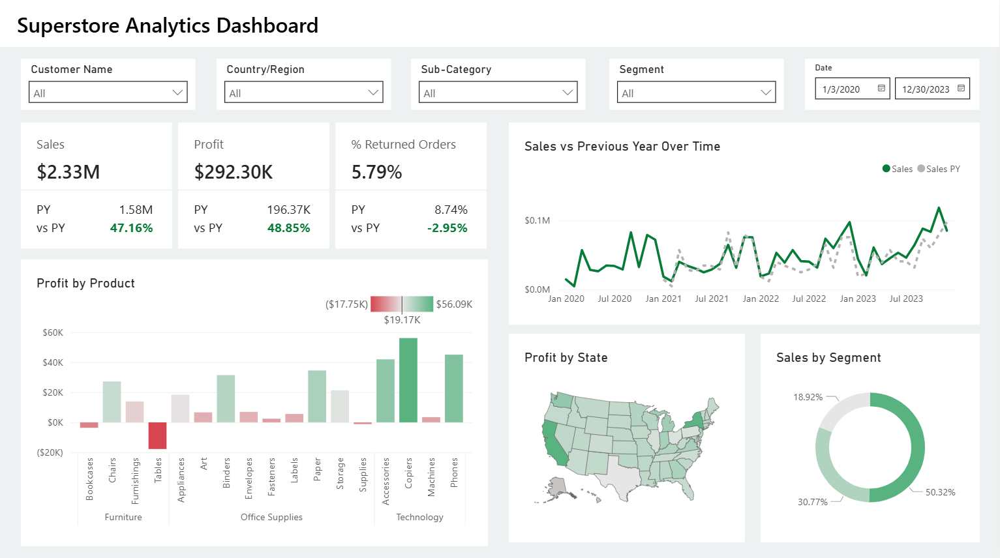

# Superstore Analytics Dashboard

## 📌 Project Description

This project is an end-to-end **Power BI Dashboard** built using the **Superstore sample dataset**. The goal is to create an interactive report that answers key business questions related to **Sales, Profit, and Returned Orders**, while demonstrating the full workflow of **data transformation, data modeling, calculated measures, and visualization design**.

## 🎯 Business Questions Addressed

1. **Metrics Overview** – Show Sales, Profit, and % of Returned Orders, including **% change vs Previous Year (PY)**.
2. **Sales Trend Analysis** – Compare Sales performance with the previous year over time.
3. **Product Profitability** – Identify the most profitable and the most loss-making products.
4. **Geographical Insights** – Find out which locations contribute the most to profit.
5. **Sales by Segment** – Display sales contribution by customer segments.

## 📸 Preview Dashboard

## 🔄 Project Workflow

### 1. Data Transformation (Power Query)

* Cleaned and standardized the Orders and Returns tables.
* Removed unnecessary columns to optimize performance.
* Kept only essential fields for reporting (Order ID, Dates, Customer, Segment, Geography, Category, Product, Sales, Profit).

### 2. Data Modeling

* Built **relationships** between Orders and Returns using *Order ID*.
* Created a dedicated **Date Table** with DAX `CALENDAR` function for accurate time intelligence calculations.

### 3. Calculated Measures (DAX)

* Core metrics: **Sales, Profit, % Returned Orders**.
* Time intelligence: **Sales PY, Profit PY, % Returned Orders PY** using `SAMEPERIODLASTYEAR`.
* Comparison: **% Change vs PY** for all metrics.
* Organized all measures into a dedicated **Key Measures table** for better structure.

### 4. Visualization & Reporting

The dashboard was designed with a focus on **readability** and **data storytelling**.

* **KPI Cards** – Sales, Profit, % Returned Orders, including PY values and % change.
* **Line Chart** – Sales vs PY trend over time.
* **Bar Chart** – Profit by Product (highlighting most profitable vs most loss-making).
* **Shape Map** – Profit by State with gradient color coding.
* **Donut Chart** – Sales contribution by Segment.

## 🛠️ Tools & Technologies

* **Power BI Desktop** (Power Query, Data Modeling, DAX, Conditional Formatting, Visualizations).
* **Microsoft PowerPoint** (for UI/UX assets).

## 📊 Outcomes

The final dashboard provides insights into:

* Year-over-year growth in Sales & Profit.
* The most profitable and loss-making products.
* Geographic regions contributing the most to profit.
* Sales distribution across customer segments.
